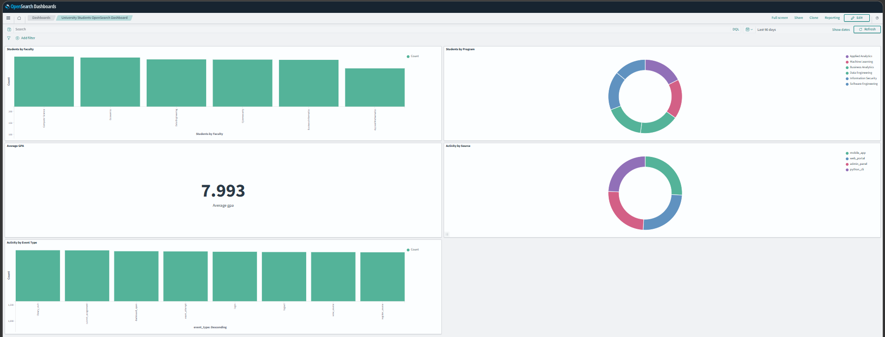
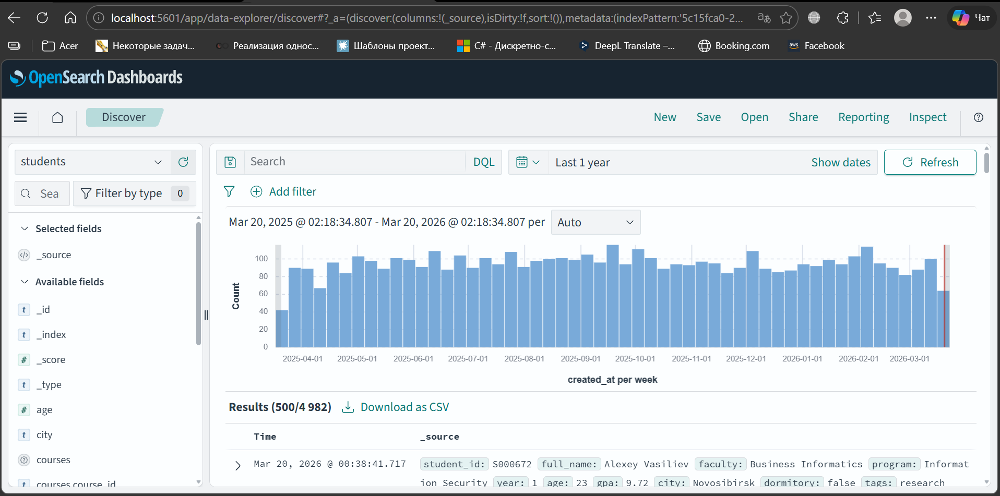
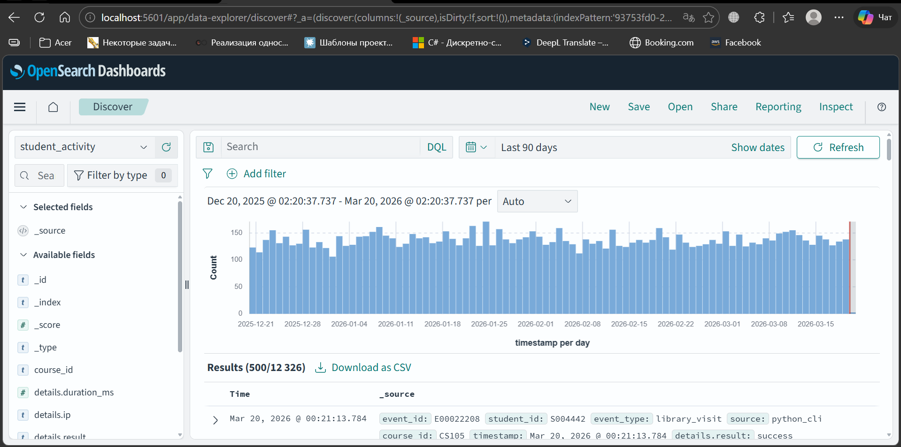

# Поисково-аналитическая NoSQL-система по студентам университета на OpenSearch

> **Автор:** Орешко Владислав  
> **Дисциплина:** Нереляционные базы данных — Итоговое задание, Модуль 3  
> **Дата:** 18.03.2026

📄 **[Отчёт (PDF)](./report/report.pdf)** — схема БД, реализация шардинга, результаты нагрузочного тестирования

---

## Описание проекта

Распределённая поисково-аналитическая система на базе OpenSearch для информационной системы университета. Реализует:

- Два индекса: **students** (профили с вложенными курсами) и **student_activity** (журнал событий)
- **3-узловой кластер OpenSearch** с первичными шардами и репликами (`students-opensearch-cluster-multi`)
- **Python CLI** для поиска, агрегаций и работы с данными
- **Скрипты нагрузочного тестирования** с сравнением кластера и одиночного узла по 6 типам запросов

---

## Структура репозитория

```
nosql-opensearch-final-project/
│
├── docker/
│   ├── docker-compose.cluster.yml     # 3-узловой кластер OpenSearch + Dashboards
│   └── docker-compose.single.yml      # Одиночный узел (для бенчмарков)
│
├── mappings/
│   ├── students_mapping.json          # Маппинг индекса students (1 шард, single-node)
│   ├── students_mapping_cluster.json  # Маппинг students (3 шарда, кластер)
│   ├── student_activity_mapping.json
│   └── student_activity_mapping_cluster.json
│
├── data/
│   ├── students.jsonl                 # 5 000 синтетических записей студентов
│   └── student_activity.jsonl         # 25 000 событий активности
│
├── scripts/
│   ├── generate_data.py               # Генератор синтетических данных
│   ├── create_indices.py              # Создание индексов с маппингами
│   ├── bulk_load.py                   # Массовая загрузка данных
│   ├── search_cli.py                  # Python CLI для поиска и агрегаций
│   ├── benchmark.py                   # Скрипт нагрузочного тестирования
│   └── plot_benchmark_results.py      # Построение графиков по результатам
│
├── benchmark/
│   ├── results_single.csv             # Результаты для одиночного узла
│   ├── results_cluster.csv            # Результаты для кластера
│   ├── results_combined.csv           # Объединённые результаты
│   ├── plots/                         # Графики производительности (PNG)
│   └── workloads/university/          # YCSB-совместимые воркло́ды
│
├── screenshots/                       # Скриншоты OpenSearch Dashboards и кластера
├── snapshots/                         # Снапшоты индексов OpenSearch
│
└── report/
    └── report.pdf                     # Итоговый отчёт (3 страницы)
```

---

## Быстрый старт

### Требования

- Docker + Docker Compose
- Python 3.10+

```bash
pip install opensearch-py requests
```

### 1 — Запуск кластера

```bash
docker-compose -f docker/docker-compose.cluster.yml up -d
```

Подождите ~30 секунд, затем проверьте статус:

```bash
curl http://localhost:9201/_cluster/health?pretty
# Ожидается: "status": "green", "number_of_nodes": 3
```

Для одиночного узла:

```bash
docker-compose -f docker/docker-compose.single.yml up -d
# Доступен на порту 9200
```

### 2 — Создание индексов

```bash
# Для одиночного узла
python scripts/create_indices.py --url http://localhost:9200 \
    --students-mapping mappings/students_mapping.json \
    --activity-mapping mappings/student_activity_mapping.json

# Для кластера
python scripts/create_indices.py --url http://localhost:9201 \
    --students-mapping mappings/students_mapping_cluster.json \
    --activity-mapping mappings/student_activity_mapping_cluster.json
```

### 3 — Генерация и загрузка данных

```bash
# Генерация: 5000 студентов, 5 событий на студента
python scripts/generate_data.py --students 5000 --events-per-student 5

# Загрузка данных
python scripts/bulk_load.py --url http://localhost:9201 \
    --students-file data/students.jsonl \
    --activity-file data/student_activity.jsonl
```

### 4 — Python CLI

```bash
# Найти студента по ID
python scripts/search_cli.py --url http://localhost:9201 get-student --student-id S000001

# Поиск по факультету
python scripts/search_cli.py search-faculty --faculty "Computer Science" --size 5

# Поиск по программе
python scripts/search_cli.py search-program --program "Data Engineering" --size 10

# Студенты, записанные на конкретный курс (nested-запрос)
python scripts/search_cli.py search-course --course-id DB101

# Рейтинг факультетов
python scripts/search_cli.py top-faculties

# Средний GPA
python scripts/search_cli.py average-gpa

# Статистика активности
python scripts/search_cli.py activity-stats
```

### 5 — Нагрузочное тестирование

```bash
# Тест одиночного узла
python scripts/benchmark.py --environment single-node \
    --single-url http://localhost:9200 \
    --output-csv benchmark/results_single.csv

# Тест кластера
python scripts/benchmark.py --environment cluster \
    --cluster-url http://localhost:9201 \
    --output-csv benchmark/results_cluster.csv

# Построение графиков
python scripts/plot_benchmark_results.py \
    --single benchmark/results_single.csv \
    --cluster benchmark/results_cluster.csv \
    --output-dir benchmark/plots/
```

---

## Архитектура кластера

```
┌───────────────────────────────────────────────────────┐
│          students-opensearch-cluster-multi            │
│                                                       │
│  ┌─────────────┐  ┌─────────────┐  ┌───────────────┐  │
│  │   node1     │  │   node2     │  │  node3  (*)   │  │
│  │ 172.19.0.4  │  │ 172.19.0.3  │  │ 172.19.0.2    │  │
│  │  P0 P1 R2   │  │  R0 P2 R1   │  │  R0 R1 R2     │  │
│  │  port:9201  │  │  port:9202  │  │  port:9203    │  │
│  └─────────────┘  └─────────────┘  └───────────────┘  │
│       (*) — текущий cluster_manager                   │
│  Dashboards: port 5602                                │
└───────────────────────────────────────────────────────┘
```

| Параметр | Значение |
|---|---|
| Количество узлов | 3 (роли: cluster_manager, data, ingest) |
| Первичных шардов | 3 (индекс students) |
| Реплик на шард | 1 |
| Статус кластера | 🟢 GREEN |
| Всего активных шардов | 26 (по всем индексам) |
| JVM heap на узел | 1 GB |

---

## Схема базы данных

### Индекс `students`

| Поле | Тип | Примечание |
|---|---|---|
| `student_id` | keyword | Уникальный ID, напр. `S000672` |
| `full_name` | text + keyword | Полнотекстовый поиск + сортировка |
| `faculty` | keyword | Для агрегаций |
| `program` | keyword | Образовательная программа |
| `year` | integer | Год обучения (1–4) |
| `age` | integer | Возраст |
| `gpa` | float | Средний балл (6–10) |
| `city` | keyword | Родной город |
| `dormitory` | boolean | Проживание в общежитии |
| `created_at` | date | Дата создания |
| `tags` | keyword[] | Теги: scholarship, olympiad и др. |
| `courses` | **nested** | Массив дисциплин |

`courses` (nested):

| Поле | Тип |
|---|---|
| `course_id` | keyword |
| `course_name` | text + keyword |
| `grade` | integer |

### Индекс `student_activity`

| Поле | Тип | Примечание |
|---|---|---|
| `event_id` | keyword | Уникальный ID события |
| `student_id` | keyword | Ссылка на студента |
| `event_type` | keyword | login, submit_assignment, library_visit и др. |
| `source` | keyword | python_cli, web_portal, mobile_app, admin_panel |
| `course_id` | keyword | Связанный курс |
| `timestamp` | date | Метка времени |
| `details` | object | ip, duration_ms, result |

---

## Результаты нагрузочного тестирования

100 повторений на каждый тип запроса.

### Задержка поиска (avg, мс) — меньше лучше

| Запрос | Кластер | Одиночный узел |
|---|---|---|
| `activity_by_source` | 5.45 | 4.42 |
| `agg_faculty` | 10.29 | 4.73 |
| `avg_gpa` | 5.76 | 4.04 |
| `nested_course` | 8.50 | 5.27 |
| `term_faculty` | 12.74 | 6.44 |
| `term_program` | 8.43 | 5.44 |

### Пропускная способность bulk insert (docs/sec) — больше лучше

| Окружение | Индекс | docs/sec |
|---|---|---|
| Одиночный узел | students | ~3 139 |
| Одиночный узел | student_activity | ~10 617 |
| Кластер | students | ~2 661 |
| Кластер | student_activity | ~7 244 |

> При текущем масштабе одиночный узел превосходит кластер по задержке и пропускной способности из-за накладных расходов на межузловую координацию. Ценность кластера — **отказоустойчивость** и **горизонтальная масштабируемость** при росте данных.

---

## OpenSearch Dashboards

Доступны по адресу **http://localhost:5602** (кластер)

Реализованные визуализации:

- **Students by Faculty** — столбчатая диаграмма
- **Students by Program** — кольцевая диаграмма
- **Average GPA** — метрика
- **Activity by Source** — кольцевая диаграмма
- **Activity by Event Type** — столбчатая диаграмма






